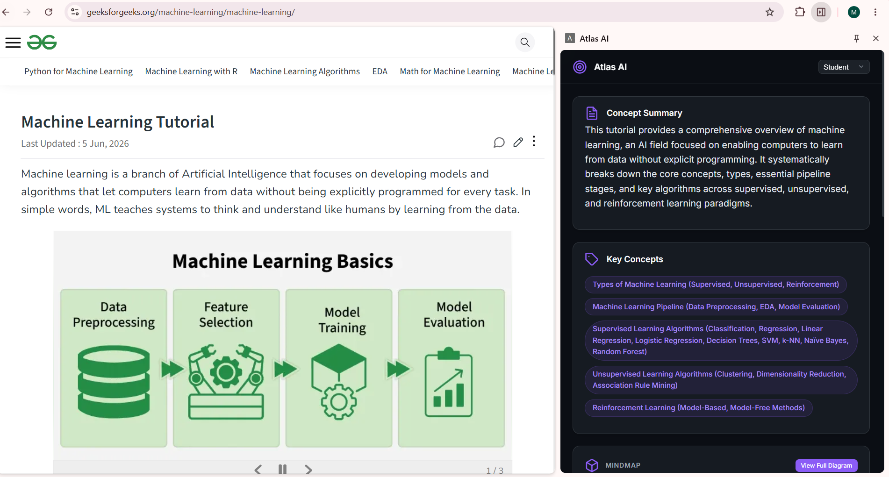
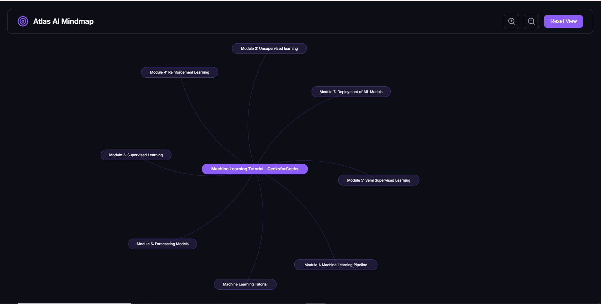

# Atlas AI: The Neural Navigator 🧭

**Atlas AI** is an AI-powered Chrome extension designed to supercharge the way students and developers consume online content. Built with a Python FastAPI backend and Gemini 2.5 Flash, it acts as a real-time learning companion that understands the context of what you are reading.

## 📸 Project Showcase

### The Atlas Extension


### Automatic Mind Maps


### Contextual GitHub Repo Search


## ✨ Key Features

- **Smart Summaries:** Extracts key concepts and summarizes long articles instantly.
- **Visual Learning:** Automatically generates interactive mind maps of the page content.
- **Contextual Chat:** Ask questions and get answers based specifically on the page you are reading.
- **Struggle Detection:** Detects when a user is stuck (e.g., erratic scrolling, rage clicking) and offers helpful hints.
- **Code Search:** Suggests relevant GitHub repositories based on the current topic.

## 🛠️ Tech Stack

- **Frontend:** Vanilla JavaScript, HTML, CSS (Chrome Extension Manifest V3)
- **Backend:** Python, FastAPI, Uvicorn
- **AI / LLM:** Google Gemini 2.5 Flash API

## 🚀 How to Run Locally

To run this project, you will need to start both the Python backend and load the Chrome extension.

### 1. Start the Backend (FastAPI)

1. Open a terminal and navigate to the backend directory:
   ```bash
   cd atlas-backend
   ```
2. Create and activate a virtual environment (optional but recommended):
   ```bash
   python -m venv .venv
   # Windows
   .\.venv\Scripts\Activate
   # Mac/Linux
   source .venv/bin/activate
   ```
3. Install the required dependencies:
   ```bash
   pip install -r requirements.txt
   ```
4. **Environment Variables:** Create a `.env` file inside `atlas-backend` and add your Gemini API key:
   ```env
   GEMINI_API_KEY=your_api_key_here
   ```
5. Start the backend server on **port 8001**:
   ```bash
   uvicorn main:app --reload --port 8001
   ```

### 2. Load the Chrome Extension

1. Open Google Chrome and navigate to `chrome://extensions/`.
2. Turn on **Developer mode** (toggle switch in the top right corner).
3. Click on the **Load unpacked** button.
4. Select the `atlas-extension` folder from this repository.
5. Click the Atlas AI icon in your browser to start analyzing pages!

## 🔒 Security Note
**Never commit your `.env` file or API keys to a public repository.** This repository is configured to ignore `.env` files automatically.
